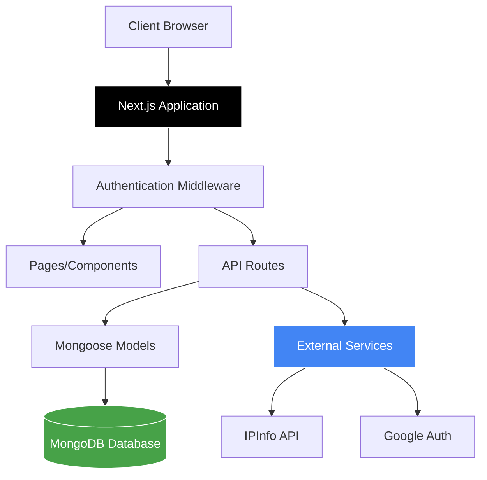
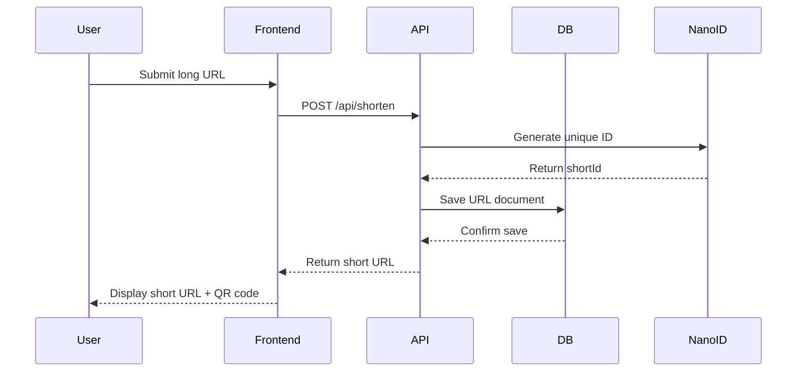
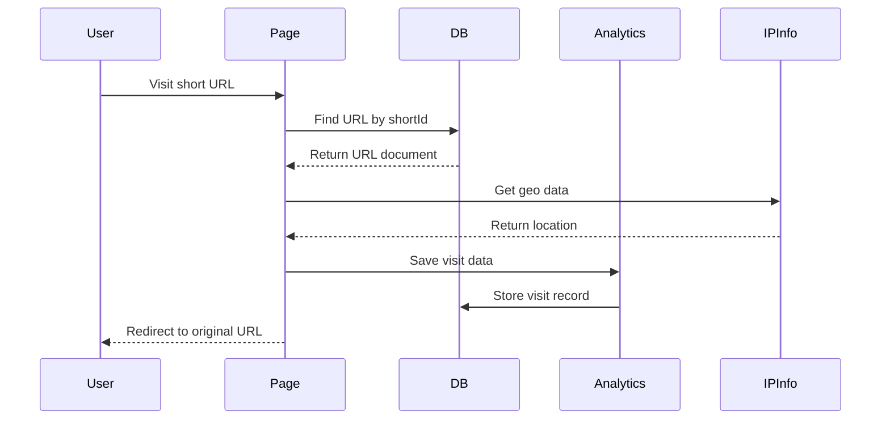
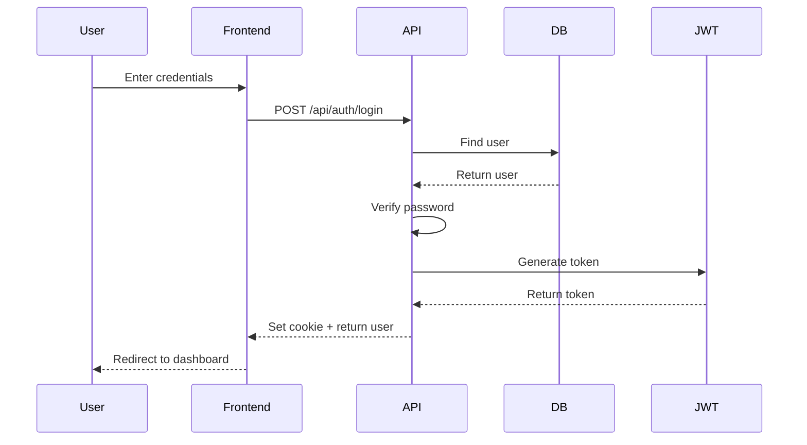

# Architecture Documentation

## System Overview

URLTRIM is a full-stack URL shortening platform built on a modern **monolithic architecture** using Next.js 15's App Router. The application combines frontend and backend in a single codebase, leveraging Next.js API routes for server-side functionality.

## Architectural Pattern

### Monolithic Next.js Application
- **Single Codebase**: Frontend and backend logic in one repository
- **API Routes**: Server-side endpoints within the Next.js app
- **File-based Routing**: Automatic routing based on file structure
- **Server Components**: React Server Components for improved performance

## High-Level Architecture



## Directory Structure & Layers

### 1. Presentation Layer (`/src/app`)

#### Pages & Components
```
/src/app/
├── page.tsx                    # Landing page (URL shortener form)
├── login/page.tsx             # Authentication pages
├── register/page.tsx
├── forgot-password/page.tsx
├── dashboard/                 # User dashboard
│   ├── page.tsx              # Dashboard home
│   ├── myurls/myurls.tsx     # URL management
│   └── referrals/referrals.tsx
├── stats/[shortId]/page.tsx  # Analytics page
└── [shortId]/page.tsx        # URL redirect handler
```

#### UI Components (`/src/app/component/ui`)
- Reusable React components
- Modal dialogs (Delete, Extend, Suspend, Rename)
- Charts and visualizations
- Loading states and spinners
- Alert and badge components

### 2. Business Logic Layer (`/src/app/api`)

#### API Route Structure
```
/src/app/api/
├── auth/                      # Authentication endpoints
│   ├── login/route.ts        # POST /api/auth/login
│   ├── register/route.ts     # POST /api/auth/register
│   ├── logout/route.ts       # POST /api/auth/logout
│   ├── verify/route.ts       # GET /api/auth/verify
│   ├── forgot-password/route.ts
│   ├── reset-password/route.ts
│   └── google/route.ts       # Google OAuth
├── shorten/route.ts          # POST /api/shorten
├── urls/                      # URL management
│   ├── route.ts              # GET /api/urls (list user URLs)
│   ├── [id]/route.ts         # GET/PUT/DELETE /api/urls/:id
│   ├── suspend/route.ts      # POST /api/urls/suspend
│   ├── extend/route.ts       # POST /api/urls/extend
│   └── rename/route.ts       # POST /api/urls/rename
├── stats/[shortId]/route.ts  # GET /api/stats/:shortId
├── referral/[shortId]/route.ts
└── referrals/                 # Referral management
    ├── create/route.ts
    ├── requests/route.ts
    ├── approve/route.ts
    └── toggle/route.ts
```

### 3. Data Access Layer (`/src/app/models`)

#### Mongoose Models
```typescript
// User Model
- User authentication and profile
- Password hashing and validation
- Password reset tokens

// URL Model
- Original and shortened URLs
- Expiration dates
- Click tracking
- Suspension status
- Referral relationships

// Visit Model
- Click analytics
- Device and browser info
- Geographic data
- Timestamp tracking

// Referral Model
- Referral user accounts
- Referral authentication
- Password management

// DeletedUrl Model
- Soft delete tracking
- Audit trail

// ReferralRequest Model
- Referral partnership requests
- Approval workflow
```

### 4. Infrastructure Layer (`/src/libs`)

#### Database Connection (`db.ts`)
- MongoDB connection management
- Connection pooling
- Global connection caching
- Error handling

#### Geolocation Service (`geo.ts`)
- IP address geolocation
- IPInfo API integration
- Location data parsing

## Data Flow

### 1. URL Shortening Flow



### 2. URL Redirect Flow



### 3. Authentication Flow



## Middleware Architecture

### Next.js Middleware (`/src/middleware.ts`)

```typescript
// Route Protection
- Intercepts requests to protected routes
- Validates JWT tokens
- Extracts user ID from token
- Injects user ID into request headers
- Redirects unauthorized users

// Protected Routes
- /dashboard/*
- /profile/*
- /api/protected/*
```

## Database Schema Design

### Collections

#### 1. Users Collection
```javascript
{
  _id: ObjectId,
  name: String,
  email: String (unique, indexed),
  password: String (hashed),
  resetPasswordToken: String,
  resetPasswordExpire: Date,
  createdAt: Date,
  updatedAt: Date
}
```

#### 2. URLs Collection
```javascript
{
  _id: ObjectId,
  originalUrl: String,
  shortId: String (unique, indexed),
  shortUrl: String (unique),
  userId: ObjectId (ref: User),
  totalClicks: Number,
  isReferral: Boolean,
  allowReferrals: Boolean,
  referralId: ObjectId (ref: User),
  originalUrlId: ObjectId (ref: Url),
  isSuspended: Boolean,
  expireAt: Date (TTL index),
  createdAt: Date,
  updatedAt: Date
}
```

#### 3. Visits Collection
```javascript
{
  _id: ObjectId,
  urlId: ObjectId (ref: Url, indexed),
  referralId: ObjectId (ref: Referral),
  ipAddress: String,
  userAgent: String,
  device: String,
  browser: String,
  os: String,
  country: String,
  city: String,
  latitude: Number,
  longitude: Number,
  continent_name: String,
  country_capital: String,
  state_prov: String,
  organization: String,
  isp: String,
  timestamp: Date (indexed)
}
```

### Indexes
- `urls.shortId`: Unique index for fast lookups
- `urls.userId`: Index for user URL queries
- `urls.expireAt`: TTL index for automatic deletion
- `visits.urlId`: Index for analytics queries
- `visits.timestamp`: Index for time-based queries
- `users.email`: Unique index for authentication

## Security Architecture

### Authentication & Authorization
1. **JWT-based Authentication**
   - Token stored in HTTP-only cookies
   - Token validation on protected routes
   - User ID extraction from token payload

2. **Password Security**
   - bcrypt hashing with salt rounds
   - Password strength validation
   - Secure password reset flow

3. **Middleware Protection**
   - Route-level authentication
   - API endpoint protection
   - Automatic redirect for unauthorized access

### Data Validation
- Zod schema validation for API inputs
- Mongoose schema validation
- TypeScript type safety

## State Management

### Client-Side State
1. **React Context API**
   - Authentication context
   - User session management

2. **Local Storage**
   - Guest user URL storage
   - Authentication tokens
   - User preferences

3. **Component State**
   - React hooks (useState, useEffect)
   - Form state management
   - UI state (modals, loading)

### Server-Side State
- Database as source of truth
- No server-side session storage
- Stateless API design

## Caching Strategy

### Database Connection Caching
```typescript
// Global mongoose connection cache
global.mongoose = {
  conn: null,
  promise: null
}
```

### Browser Caching
- Static assets cached by Next.js
- API responses not cached (real-time data)
- Image optimization with Next.js Image

## Error Handling

### API Error Responses
```typescript
{
  success: false,
  error: "Error message",
  statusCode: 400/401/404/500
}
```

### Frontend Error Handling
- Try-catch blocks for async operations
- Error state management
- User-friendly error messages
- Fallback UI components

## Scalability Considerations

### Current Architecture
- Monolithic design suitable for small-to-medium scale
- Vertical scaling (increase server resources)
- Database indexing for performance

### Future Scalability Options
1. **Horizontal Scaling**
   - Deploy multiple Next.js instances
   - Load balancer distribution
   - Shared MongoDB cluster

2. **Microservices Migration**
   - Separate URL service
   - Analytics service
   - Authentication service

3. **Caching Layer**
   - Redis for frequently accessed URLs
   - CDN for static assets
   - API response caching

4. **Database Sharding**
   - Shard by user ID
   - Shard by URL creation date
   - Geographic sharding

## Deployment Architecture

### Recommended Setup
```
┌─────────────────┐
│   Vercel Edge   │ (Next.js hosting)
└────────┬────────┘
         │
         ├──────────┐
         │          │
    ┌────▼────┐  ┌─▼──────────┐
    │ Next.js │  │  MongoDB   │
    │   App   │  │   Atlas    │
    └─────────┘  └────────────┘
         │
    ┌────▼────────┐
    │  External   │
    │  Services   │
    │  (IPInfo)   │
    └─────────────┘
```

## Performance Optimizations

1. **Frontend**
   - Code splitting
   - Lazy loading
   - Image optimization
   - Font optimization

2. **Backend**
   - Database indexing
   - Connection pooling
   - Efficient queries
   - TTL indexes for cleanup

3. **Network**
   - CDN for static assets
   - Compression
   - HTTP/2 support

## Monitoring & Logging

### Current Implementation
- Console logging for development
- Error logging in try-catch blocks
- MongoDB query logging

### Recommended Additions
- Application Performance Monitoring (APM)
- Error tracking (Sentry)
- Analytics dashboard
- Database monitoring
- Uptime monitoring
